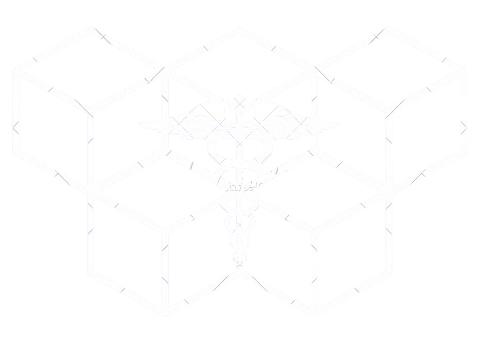

# PrivaHealth: Revolutionizing Healthcare on the Blockchain



PrivaHealth is a cutting-edge decentralized application (dApp) built on the Oasis Network, designed to transform healthcare data management. By leveraging blockchain technology, PrivaHealth empowers patients with unprecedented control over their medical records while facilitating secure collaboration between patients, doctors, and health centers.

## 🚀 Key Features

- **🔐 Patient-Controlled Access**: Patients have full authority over their medical records.
- **🔄 Secure Data Sharing**: Opt-in/out of sharing data for research purposes.
- **👥 Collaborative Healthcare**: Seamless connection between patients, doctors, and health centers.
- **🤖 AI-Assisted Health Plans**: Receive personalized health recommendations powered by advanced AI.
- **⭐ Doctor Reviews**: Manage and view doctor reviews and recommendations.
- **🛡️ Blockchain Security**: Utilize the Oasis Network for enhanced data protection and privacy.

## 🌟 Why PrivaHealth?

1. **Empowerment**: Patients are in control of their health data.
2. **Privacy**: State-of-the-art encryption ensures data confidentiality.
3. **Efficiency**: Streamlined data sharing improves healthcare delivery.
4. **Innovation**: AI-driven insights for better health outcomes.
5. **Trust**: Transparent and immutable record-keeping.

## 🛠️ Tech Stack

- **Smart Contracts**: Solidity
- **Frontend**: Vue.js
- **Blockchain**: Oasis Sapphire Network
- **Development Environment**: Hardhat
- **Ethereum Interaction**: Ethers.js

## 🚀 Quick Start

### Prerequisites

- Node.js (v14+)
- pnpm
- MetaMask browser extension

### Installation

1. Clone the repo:
   ```
   git clone https://github.com/your-username/privahealth.git
   cd privahealth
   ```

2. Install dependencies:
   ```
   pnpm install
   ```

3. Set up environment:
   Create `frontend/.env.development` with:
   ```
   VITE_PRIVA_HEALTH_ADDR=YOUR_CONTRACT_ADDRESS
   ```

4. Deploy the contract (if needed):
   ```
   cd backend
   npx hardhat deploy --network sapphire-testnet
   ```

5. Start the frontend:
   ```
   cd frontend
   pnpm dev
   ```

6. Visit `http://localhost:5173` in your browser.

## 🖥️ Usage

### For Patients
- Register your account
- Manage data sharing preferences
- Authorize healthcare providers
- View personalized health plans and doctor reviews

### For Doctors
- Access authorized patient records
- Add patient reviews and recommendations
- Utilize AI-assisted diagnostics

### For Health Centers
- Securely manage patient records
- Collaborate with patients and doctors

## 🤝 Contributing

We welcome contributions! Please see our [Contributing Guidelines](CONTRIBUTING.md) for details.

## 📄 License

This project is licensed under the MIT License - see the [LICENSE](LICENSE) file for details.

## 🙏 Acknowledgments

- Oasis Network for their privacy-preserving blockchain
- OpenAI for powering our AI health recommendations

---

# Oasis Starter dApp README

This is a skeleton for confidential Oasis dApps:

- `backend` contains the example MessageBox solidity contract, deployment and
  testing utils.
- `frontend` contains a Vue-based web application communicating with the
  backend smart contract.

This monorepo is set up for `pnpm`. Install dependencies by running:

```sh
pnpm install
```

## Backend

Move to the `backend` folder and build smart contracts:

```sh
pnpm build
```

Then, prepare your hex-encoded private key for paying the deployment gas fee
and store it as an environment variable:

```shell
export PRIVATE_KEY=0x...
```

Alternative CMD command for Windows:

```
set PRIVATE_KEY=0x...
```

To deploy the contracts to the [Sapphire Localnet], Testnet or Mainnet, use
one of the following commands:

```shell
npx hardhat deploy --network sapphire-localnet
npx hardhat deploy --network sapphire-testnet
npx hardhat deploy --network sapphire
```

If you don't need any Sapphire-specific precompiles, you can spin up the
hardhat node and deploy the contract locally:

```
npx hardhat node
npx hardhat deploy --network localhost
```

Once deployed, the MessageBox address will be reported. Remember it and store it
inside the `frontend` folder's `.env.development`, for example:

```
VITE_MESSAGE_BOX_ADDR=0x5FbDB2315678afecb367f032d93F642f64180aa3
```

[Sapphire Localnet]: https://github.com/oasisprotocol/oasis-web3-gateway/pkgs/container/sapphire-dev

## Frontend

After you compiled the backend, updated `.env.development` with the
corresponding address and a chain ID, move to the `frontend` folder, compile
and Hot-Reload frontend for Development:

```sh
pnpm dev
```

Navigate to http://localhost:5173 with your browser to view your dApp. Some
browsers (e.g. Brave) may require https connection and a CA-signed certificate
to access the wallet. In this case, read the section below on how to properly
deploy your dApp.

You can use one of the deployed test accounts and associated private key with
MetaMask. If you use the same MetaMask accounts on fresh local networks such as
Hardhat Node, Foundry Anvil or sapphire-dev docker image, don't forget to
*clear your account's activity* each time or manually specify the correct
account nonce.

### Frontend Deployment

You can build assets for deployment by running:

```sh
pnpm build
```

`dist` folder will contain the generated HTML files that can be hosted.

#### Different Website Base

If you are running dApp on a non-root base dir, add

```
BASE_DIR=/my/public/path
```

to `.env.production` and bundle the app with

```
pnpm build-only --base=/my/public/path/
```

Then copy the `dist` folder to a place of your `/my/public/path` location.

## Troubleshooting

When click button Connect Wallet, in some case you will constantly get the error: 
`Uncaught (in promise) Error: [useEthereumStore] Request account failed!`

To resolve it, try to open MetaMask and manually connect site:


